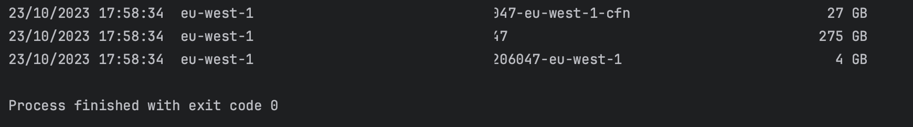

# Quickly Get Your S3 Bucket Size

> #### Inspired by https://www.slsmk.com/getting-the-size-of-an-s3-bucket-using-boto3-for-aws/                      
> #### Forked from https://gist.github.com/adaam/9df974a081253efd9db22bf06d997b00     

> **Example output.**               
>               

> **A small python script that uses Boto3.**                        
> **It retrieves the bucket size through the CloudWatch Metrics.**          

> **The original script was modified, it now only shows the buckets that have a size >= 1GB.**  
> **If you use SSO for multiple profiles you can set your profile first with `aws sso login --profile profile-name`**
> **Get your profile name from your `.aws/config` file.**

> **If you do not have a requirement file create one.**                                    
> **Install this `pip install pipreqs`**                                                          
> **Then run `pipreqs` it creates the requirements file.**

> **Install your packages with `pip install -r requirements.txt`**

> **Use `pip freeze` to see all or Python modules.**

> **Update all your modules `pip install -U -r requirements.txt`**                              
> **Then `pip freeze > requirements.txt` to update the requirement file.**          
> 
